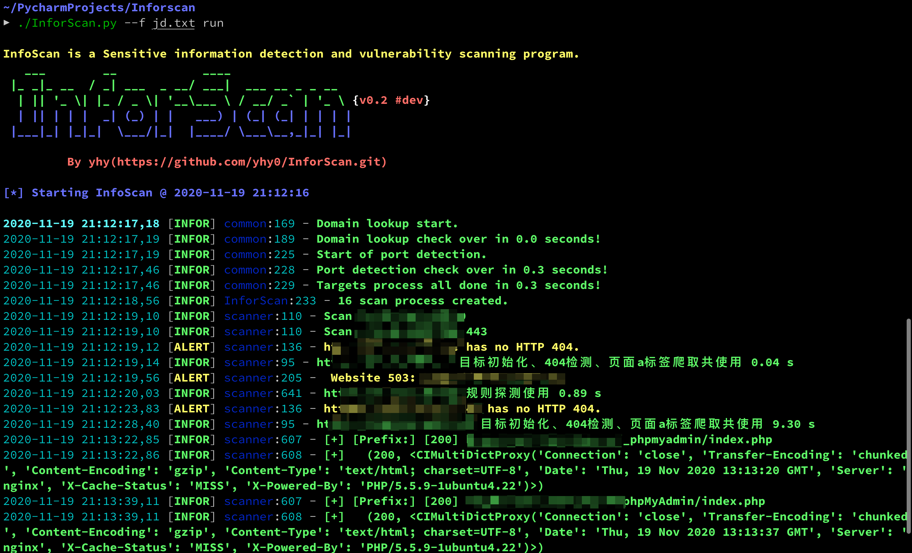

## 为啥删掉？

**拿别人的项目放在自己这，又没改什么东西，总感觉不好，哈哈，所以删掉了**

这是大佬的项目地址 https://github.com/lijiejie/BBScan.git

## 一点点小小的贡献

剩下的是我添加了一点点的规则

- black.list  规则黑名单       （好像就只添加了jd的那个jsp报错界面）
- White.list  规则白名单       （好像添加了一些登录页面的判断）
- java_web_config_files.txt     (添加了springboot 信息泄露的一些东西，有的规则字段没有写全，具体写法见下方解释，大佬们可以自己动手写一下，写好了求分享)

clone 大佬的 BBScan 后， 将这三个文件覆盖掉rules目录下的同名文件即可

## 自己添加规则

大佬文档里没说规则的一些字段解释，最近在学习这个，自己动手写一个类似的项目，帮我挖SRC捡洞，我来解释一下rules目录下的一些字段含义

rules目录下常见的就是这种

`/WEB-INF/applicationContext-slave.xml   {tag="<?xml"}    {status=200}     {type="xml"}       {root_only}`

1. `/WEB-INF/applicationContext-slave.xml `     目录 ，必有
2. `{tag="<?xml"} `   可选， 如果有的话，会比对 response.text ,即返回的html页面中是否存在tag，若没有，认为不存在该目录。
3. `{status=200} `   可选， 目录对应的状态码， 也是 作为判断该目录是否存在的一个条件，会比对页面的状态码和规则的状态码一致 ，具体判断在 BBScan.py 的 522 --- 541 行
4. `{type="xml"}`   可选，与返回头信息 content-type 字段比对，也是判断目录存在的一个条件
5. `{root_only}`  可选， 这个是表示该目录只在网站根目录下存在，之后与网站根目录拼接，进行检测，比如 https://www.baidu.com/WEB-INF/applicationContext-slave.xml 这样检查一次， 在  https://www.baidu.com/test/  这样的二级目录，并不会拼接检查，提高效率 ，详见   BBScan.py 的369 行

大概就这些

## 展望

前面说了，最近在比着大佬的项目，学习写一个自己的扫描器（现阶段就是在照抄）。水平有限，写了一段时间了，再加上改用了python3的协程，第一次接触，好多都不会，一堆问题，有时想想用大佬的不就好了，造什么轮子，但是不能当咸鱼啊，咸鱼久了就真是咸的不能再咸了。

经过一段时间摸打滚爬，虽然还有很多问题，但是

它可以**运行**了，跑起来了，等我解决Bug，就可以愉快的捡洞了

界面从 [oneforall](https://github.com/shmilylty/OneForAll.git) 拿的，也用到了 fire 这个框架，挺好用，  内核现在还是[BBScan](https://github.com/lijiejie/BBScan.git)为主，

最近又看到一个项目[Packer-Fuzzer](https://github.com/rtcatc/Packer-Fuzzer)，觉得挺好，等我解决完Bug，考虑把其中的一些功能copy进来,,嘿嘿。

## 未完，待续 ，敬请期待。。。

